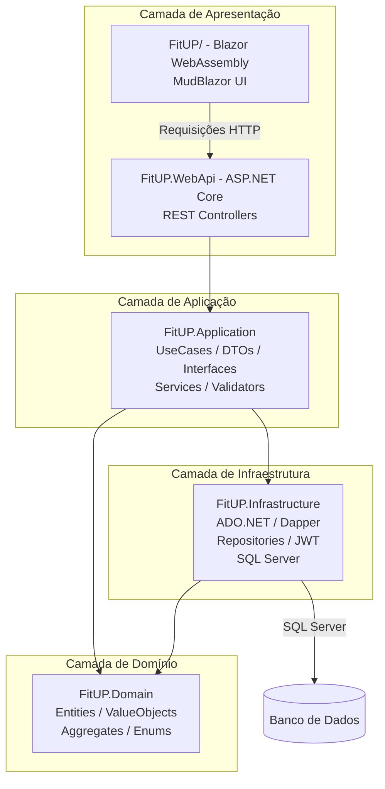
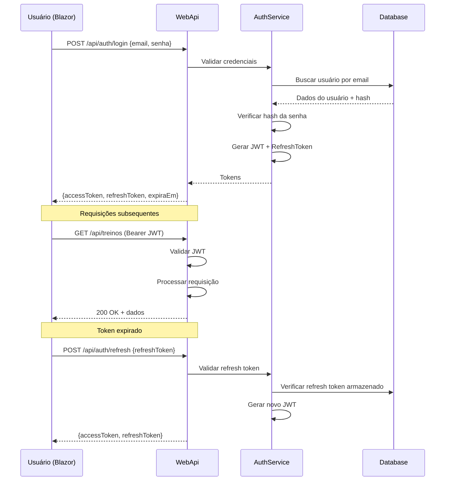
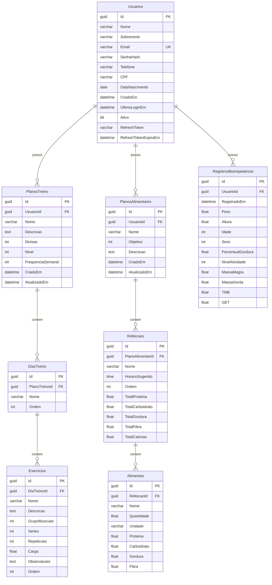

# 🏗️ Plano de Arquitetura — Backend FitUP

## 1. Estrutura Geral do Repositório

```
FitUP/
├── FitUP.slnx                          # Solution file (raiz)
│
├── src/                                # Código do Backend
│   ├── FitUP.Domain/                   # Camada de Domínio (DDD)
│   ├── FitUP.Application/              # Casos de Uso / Aplicação
│   ├── FitUP.Infrastructure/           # Persistência, Repositórios, ADO.NET
│   └── FitUP.WebApi/                   # API REST (Controllers)
│
├── FitUP/                              # Front-end Blazor WebAssembly (EXISTENTE)
│   ├── Layout/
│   ├── Pages/
│   ├── wwwroot/
│   └── ...
│
├── tests/                              # Testes
│   ├── FitUP.Domain.Tests/
│   ├── FitUP.Application.Tests/
│   └── FitUP.WebApi.Tests/
│
├── RESUMO_PROJETO.md
└── README.md
```

---

## 2. Clean Architecture — Visão Geral



### Regras de Dependência

- **Domain**: Não depende de nada (camada mais interna)
- **Application**: Depende apenas de `Domain`
- **Infrastructure**: Depende de `Domain` e `Application` (implementa interfaces)
- **WebApi**: Depende de `Application` e `Infrastructure` (via IoC)

---

## 3. Domínios e Entidades Mapeadas

Com base na análise do front-end, identificamos os seguintes domínios:

### 3.1. Domínio de Usuário

```csharp
public class Usuario
{
    public Guid Id { get; private set; }
    public string Nome { get; private set; }
    public string Sobrenome { get; private set; }
    public string Email { get; private set; }
    public string SenhaHash { get; private set; }
    public string? Telefone { get; private set; }
    public string? CPF { get; private set; }
    public DateTime? DataNascimento { get; private set; }
    public DateTime CriadoEm { get; private set; }
    public DateTime? UltimoLoginEm { get; private set; }
    public bool Ativo { get; private set; }
    public string? RefreshToken { get; private set; }
    public DateTime? RefreshTokenExpiraEm { get; private set; }
}
```

### 3.2. Domínio de Treino

```csharp
public class PlanoTreino
{
    public Guid Id { get; private set; }
    public string Nome { get; private set; }
    public string Descricao { get; private set; }
    public int Divisao { get; private set; }       // Enum: 0=UpperLower, 1=FullBody, 2=PPL, 3=ABCD
    public int Nivel { get; private set; }          // Enum: 0=Iniciante, 1=Intermediario, 2=Avancado
    public int FrequenciaSemanal { get; private set; }
    public Guid UsuarioId { get; private set; }
    public DateTime CriadoEm { get; private set; }
    public DateTime? AtualizadoEm { get; private set; }
    public List<DiaTreino> Dias { get; private set; }
}

public class DiaTreino
{
    public Guid Id { get; private set; }
    public Guid PlanoTreinoId { get; private set; }
    public string Nome { get; private set; }
    public int Ordem { get; private set; }
    public List<Exercicio> Exercicios { get; private set; }
}

public class Exercicio
{
    public Guid Id { get; private set; }
    public Guid DiaTreinoId { get; private set; }
    public string Nome { get; private set; }
    public string? Descricao { get; private set; }
    public int GrupoMuscular { get; private set; }  // Enum
    public int Series { get; private set; }
    public int Repeticoes { get; private set; }
    public double? Carga { get; private set; }
    public string? Observacoes { get; private set; }
    public int Ordem { get; private set; }
}
```

### 3.3. Domínio de Nutrição

```csharp
public class PlanoAlimentar
{
    public Guid Id { get; private set; }
    public string Nome { get; private set; }
    public int Objetivo { get; private set; }       // Enum: 0=Bulking, 1=Cutting, 2=Manutencao
    public string Descricao { get; private set; }
    public Guid UsuarioId { get; private set; }
    public DateTime CriadoEm { get; private set; }
    public DateTime? AtualizadoEm { get; private set; }
    public List<Refeicao> Refeicoes { get; private set; }
}

public class Refeicao
{
    public Guid Id { get; private set; }
    public Guid PlanoAlimentarId { get; private set; }
    public string Nome { get; private set; }
    public TimeSpan? HorarioSugerido { get; private set; }
    public int Ordem { get; private set; }
    public double TotalProteina { get; private set; }
    public double TotalCarboidrato { get; private set; }
    public double TotalGordura { get; private set; }
    public double TotalFibra { get; private set; }
    public double TotalCalorias { get; private set; }
    public List<Alimento> Alimentos { get; private set; }
}

public class Alimento
{
    public Guid Id { get; private set; }
    public Guid RefeicaoId { get; private set; }
    public string Nome { get; private set; }
    public double Quantidade { get; private set; }
    public string Unidade { get; private set; }
    public double Proteina { get; private set; }
    public double Carboidrato { get; private set; }
    public double Gordura { get; private set; }
    public double Fibra { get; private set; }
}
```

### 3.4. Domínio de Bioimpedância

```csharp
public class RegistroBioimpedancia
{
    public Guid Id { get; private set; }
    public Guid UsuarioId { get; private set; }
    public DateTime RegistradoEm { get; private set; }
    public double Peso { get; private set; }
    public double Altura { get; private set; }
    public int Idade { get; private set; }
    public int Sexo { get; private set; }             // 0=Masculino, 1=Feminino
    public double PercentualGordura { get; private set; }
    public int NivelAtividade { get; private set; }   // 0=Sedentario ... 4=Extremo

    // Campos calculados
    public double MassaMagra { get; private set; }
    public double MassaGorda { get; private set; }
    public double TMB { get; private set; }
    public double GET { get; private set; }
}
```

### 3.5. Enums

```csharp
public enum DivisaoTreino { UpperLower, FullBody, PPL, ABCD }
public enum NivelDificuldade { Iniciante, Intermediario, Avancado }
public enum GrupoMuscular { Peito, Costas, Ombros, Biceps, Triceps, Quadriceps, Posterior, Gluteos, Panturrilha, Abdomen, CorpoInteiro }
public enum ObjetivoDieta { Bulking, Cutting, Manutencao }
public enum Sexo { Masculino, Feminino }
public enum NivelAtividade { Sedentario, Leve, Moderado, Intenso, Extremo }
```

---

## 4. Estrutura de Pastas Detalhada

```
src/
├── FitUP.Domain/
│   ├── Entities/
│   │   ├── Usuario.cs
│   │   ├── PlanoTreino.cs
│   │   ├── DiaTreino.cs
│   │   ├── Exercicio.cs
│   │   ├── PlanoAlimentar.cs
│   │   ├── Refeicao.cs
│   │   ├── Alimento.cs
│   │   └── RegistroBioimpedancia.cs
│   ├── Enums/
│   │   ├── DivisaoTreino.cs
│   │   ├── NivelDificuldade.cs
│   │   ├── GrupoMuscular.cs
│   │   ├── ObjetivoDieta.cs
│   │   ├── Sexo.cs
│   │   └── NivelAtividade.cs
│   └── FitUP.Domain.csproj
│
├── FitUP.Application/
│   ├── DTOs/
│   │   ├── Usuario/
│   │   │   ├── LoginRequestDto.cs
│   │   │   ├── RegistrarRequestDto.cs
│   │   │   └── UsuarioPerfilDto.cs
│   │   ├── Treino/
│   │   │   ├── PlanoTreinoDto.cs
│   │   │   └── ExercicioDto.cs
│   │   ├── Nutricao/
│   │   │   ├── PlanoAlimentarDto.cs
│   │   │   └── MacronutrientesDto.cs
│   │   └── Bioimpedancia/
│   │       ├── BioimpedanciaInputDto.cs
│   │       └── BioimpedanciaResultadoDto.cs
│   ├── Interfaces/
│   │   ├── IUsuarioRepository.cs
│   │   ├── IPlanoTreinoRepository.cs
│   │   ├── IPlanoAlimentarRepository.cs
│   │   ├── IRegistroBioimpedanciaRepository.cs
│   │   ├── IAuthService.cs
│   │   └── IUnitOfWork.cs
│   ├── Services/
│   │   ├── CalculadoraBioimpedanciaService.cs
│   │   └── CalculadoraMacroService.cs
│   ├── UseCases/
│   │   ├── Auth/
│   │   │   ├── LoginUseCase.cs
│   │   │   ├── RegistrarUseCase.cs
│   │   │   └── RefreshTokenUseCase.cs
│   │   ├── Treino/
│   │   │   ├── CriarPlanoTreinoUseCase.cs
│   │   │   ├── ObterPlanosTreinoUseCase.cs
│   │   │   └── AtualizarPlanoTreinoUseCase.cs
│   │   ├── Nutricao/
│   │   │   ├── CriarPlanoAlimentarUseCase.cs
│   │   │   └── CalcularMacrosUseCase.cs
│   │   └── Bioimpedancia/
│   │       └── CalcularBioimpedanciaUseCase.cs
│   └── FitUP.Application.csproj
│
├── FitUP.Infrastructure/
│   ├── Data/
│   │   ├── SqlConnectionFactory.cs
│   │   └── Scripts/
│   │       ├── 001_CriarTabelas.sql
│   │       └── 002_SeedData.sql
│   ├── Repositories/
│   │   ├── UsuarioRepository.cs
│   │   ├── PlanoTreinoRepository.cs
│   │   ├── PlanoAlimentarRepository.cs
│   │   └── RegistroBioimpedanciaRepository.cs
│   ├── Auth/
│   │   ├── JwtService.cs
│   │   └── HashSenhaService.cs
│   └── FitUP.Infrastructure.csproj
│
└── FitUP.WebApi/
    ├── Controllers/
    │   ├── AuthController.cs
    │   ├── UsuariosController.cs
    │   ├── PlanosTreinoController.cs
    │   ├── PlanosAlimentaresController.cs
    │   └── BioimpedanciaController.cs
    ├── Middleware/
    │   └── ExceptionHandlingMiddleware.cs
    ├── Program.cs
    ├── appsettings.json
    ├── appsettings.Development.json
    └── FitUP.WebApi.csproj
```

---

## 5. Estratégia de Autenticação

### Fluxo de Autenticação



### Tecnologias de Autenticação

| Componente                    | Tecnologia                                      | Motivo                                                         |
| ----------------------------- | ----------------------------------------------- | -------------------------------------------------------------- |
| **Hash de senha**             | `BCrypt.Net-Next`                               | Essencial para segurança                                       |
| **JWT**                       | `Microsoft.AspNetCore.Authentication.JwtBearer` | Nativo do ASP.NET Core, necessário para autenticação stateless |
| **Refresh Token**             | Implementação manual com ADO.NET                | Armazenado em tabela no SQL Server                             |
| **Validade do Access Token**  | 15-30 minutos                                   | Padrão de segurança                                            |
| **Validade do Refresh Token** | 7 dias                                          | Renovação periódica                                            |

---

## 6. Estratégia de API e Comunicação

### Endpoints REST

#### Autenticação

| Método | Rota                  | Descrição                        |
| ------ | --------------------- | -------------------------------- |
| `POST` | `/api/auth/registrar` | Cadastro de usuário              |
| `POST` | `/api/auth/login`     | Login                            |
| `POST` | `/api/auth/refresh`   | Renovar token                    |
| `POST` | `/api/auth/logout`    | Logout (invalidar refresh token) |

#### Usuário

| Método | Rota                     | Descrição                |
| ------ | ------------------------ | ------------------------ |
| `GET`  | `/api/usuarios/me`       | Perfil do usuário logado |
| `PUT`  | `/api/usuarios/me`       | Atualizar perfil         |
| `PUT`  | `/api/usuarios/me/senha` | Alterar senha            |

#### Treinos

| Método   | Rota                           | Descrição                                  |
| -------- | ------------------------------ | ------------------------------------------ |
| `GET`    | `/api/planos-treino`           | Listar planos de treino do usuário         |
| `POST`   | `/api/planos-treino`           | Criar novo plano de treino                 |
| `GET`    | `/api/planos-treino/{id}`      | Obter plano de treino por ID               |
| `PUT`    | `/api/planos-treino/{id}`      | Atualizar plano de treino                  |
| `DELETE` | `/api/planos-treino/{id}`      | Remover plano de treino                    |
| `GET`    | `/api/planos-treino/templates` | Listar templates de treino (pré-definidos) |

#### Nutrição

| Método   | Rota                                      | Descrição                       |
| -------- | ----------------------------------------- | ------------------------------- |
| `GET`    | `/api/planos-alimentares`                 | Listar planos alimentares       |
| `POST`   | `/api/planos-alimentares`                 | Criar plano alimentar           |
| `GET`    | `/api/planos-alimentares/{id}`            | Obter plano alimentar           |
| `PUT`    | `/api/planos-alimentares/{id}`            | Atualizar plano alimentar       |
| `DELETE` | `/api/planos-alimentares/{id}`            | Remover plano alimentar         |
| `POST`   | `/api/planos-alimentares/calcular-macros` | Calcular macronutrientes ideais |

#### Bioimpedância

| Método | Rota                           | Descrição              |
| ------ | ------------------------------ | ---------------------- |
| `POST` | `/api/bioimpedancia/calcular`  | Calcular bioimpedância |
| `GET`  | `/api/bioimpedancia/historico` | Histórico de medições  |
| `GET`  | `/api/bioimpedancia/ultimo`    | Última medição         |

### Padrão de Resposta da API

```csharp
// Sucesso
{
    "sucesso": true,
    "dados": { ... },
    "mensagem": null
}

// Erro
{
    "sucesso": false,
    "dados": null,
    "mensagem": "Erro de validação",
    "erros": {
        "email": ["O e-mail já está em uso."],
        "senha": ["A senha deve ter no mínimo 6 caracteres."]
    }
}
```

---

## 7. Tecnologias e Dependências

### Pacotes NuGet (mínimos necessários)

| Pacote                                          | Versão | Finalidade                              |
| ----------------------------------------------- | ------ | --------------------------------------- |
| `Microsoft.Data.SqlClient`                      | 6.\*   | Driver nativo para SQL Server (ADO.NET) |
| `Microsoft.AspNetCore.Authentication.JwtBearer` | 10.\*  | Autenticação JWT (nativo ASP.NET Core)  |
| `BCrypt.Net-Next`                               | 4.\*   | Hash de senhas (segurança obrigatória)  |
| `Swashbuckle.AspNetCore`                        | 7.\*   | Swagger/OpenAPI (documentação)          |

## 8. Plano de Implementação (Ordem Sugerida)

### Fase 1 — Fundação

1. **Criar estrutura de pastas** `src/` com os 4 projetos .NET
2. **Implementar `FitUP.Domain`**: Entidades e Enums
3. **Criar script SQL** `001_CriarTabelas.sql` com todas as tabelas
4. **Implementar `SqlConnectionFactory`** para gerenciar conexões ADO.NET
5. **Configurar `FitUP.WebApi`**: Program.cs, CORS, Swagger, JWT

### Fase 2 — Autenticação

6. **Implementar `HashSenhaService`** com BCrypt
7. **Implementar `JwtService`** para geração/validação de tokens
8. **Criar `UsuarioRepository`** com ADO.NET puro
9. **Criar `AuthController`**: Registrar, Login, Refresh, Logout
10. **Criar `ExceptionHandlingMiddleware`** para tratamento global de erros

### Fase 3 — Domínio de Treino

11. **Criar `PlanoTreinoRepository`** com ADO.NET puro
12. **Implementar use cases** de treino (CRUD)
13. **Criar `PlanosTreinoController`**
14. **Criar script SQL** `002_SeedData.sql` com templates de treino

### Fase 4 — Domínio de Nutrição

15. **Criar `PlanoAlimentarRepository`** com ADO.NET puro
16. **Implementar `CalculadoraMacroService`** com lógica de cálculo
17. **Criar `PlanosAlimentaresController`**
18. **Seed data** com planos alimentares base

### Fase 5 — Domínio de Bioimpedância

19. **Criar `RegistroBioimpedanciaRepository`** com ADO.NET puro
20. **Extrair lógica de cálculo** do front-end para `CalculadoraBioimpedanciaService`
21. **Criar `BioimpedanciaController`**

### Fase 6 — Integração Front-End

22. **Configurar HttpClient no Blazor** para apontar para a WebApi
23. **Criar serviços no front-end** (`AuthService`, `TreinoService`, etc.)
24. **Substituir lógica inline** por chamadas HTTP
25. **Implementar fluxo de login real** com armazenamento de JWT
26. **Testar fluxo completo** (cadastro → login → treinos → nutrição → bioimpedância)

### Fase 7 — Qualidade

27. **Testes unitários** com xUnit
28. **Documentação Swagger** completa

---

## 9. Diagrama de Dados (SQL Server)



---

## 10. Decisões Arquiteturais

| Decisão            | Opção Escolhida                              | Motivo                                  |
| ------------------ | -------------------------------------------- | --------------------------------------- |
| **Acesso a dados** | ADO.NET puro (`SqlConnection`, `SqlCommand`) | Sem ORM, C# puro                        |
| **Autenticação**   | JWT + Refresh Token                          | Stateless, escalável, padrão de mercado |
| **Validação**      | Manual com classes `Validator` próprias      | Sem framework externo                   |
| **Mapeamento**     | Manual (extensão `ToDto()` / `ToEntity()`)   | Sem AutoMapper                          |
| **Banco de Dados** | SQL Server                                   | Conforme README do projeto              |
| **Testes**         | xUnit + Moq                                  | Padrão do ecossistema .NET              |

---

## 11. Próximos Passos Imediatos

1. ✅ **Análise do front-end concluída** — [`RESUMO_PROJETO.md`](../RESUMO_PROJETO.md)
2. ✅ **Arquitetura do backend definida** — este documento
3. ⬜ **Criar estrutura de pastas** `src/` com os projetos .NET
4. ⬜ **Configurar solution** com todos os projetos
5. ⬜ **Implementar Domain Layer** (entidades e enums)
6. ⬜ **Criar script SQL** de criação das tabelas
7. ⬜ **Implementar Infrastructure** (SqlConnectionFactory, repositórios ADO.NET)
8. ⬜ **Implementar WebApi** (Program.cs, CORS, Swagger, JWT)
9. ⬜ **Iniciar desenvolvimento dos use cases**

---

> **Nota:** Este plano segue Clean Architecture com C# puro, sem frameworks externos além do JWT (nativo ASP.NET Core) e BCrypt (essencial para segurança de senhas). Toda a camada de dados será feita com ADO.NET puro — `SqlConnection`, `SqlCommand`, `SqlDataReader` — garantindo total controle sobre as queries SQL.
